This repository contains the implementation of my undergraduate Project: 

**Author**: Mahdi Razi Gandomani  
**Supervisors**: Dr. Ali Mohades  
**Institution**: Amirkabir University of Technology
**Date**: April 2025

---

## Abstract

Inspired by recent developments in Kolmogorov-Arnold Networks (KANs), this project explores using a single B-spline activation function across each layer in multi layer perceptrons (MLPs), in order to reduce runtime overhead while maintaining the beneficial properties of learnable spline based activations. Through experiments on Permuted MNIST and Split MNIST, we demonstrate that B-spline activations achieve better performance compared to other activation functions (ReLU, Tanh, GELU, PReLU, Swish) and also combining them with established continual learning methods (Elastic Weight Consolidation (EWC) and Experience Replay (ER)) can lead to improved performance on continual learning metrics.

---

## 1. Introduction

### 1.1 Catastrophic Forgetting

**Catastrophic forgetting** is the phenomenon where neural networks severely forget previously learned information upon learning new information [2]. This represents a fundamental challenge in **continual learning** scenarios where neural networks must learn sequential tasks without forgetting prior knowledge. The main cause of catastrophic forgetting is the overlap in representations in the layers of neural networks; When a neural network is trained sequentially on new tasks, gradient updates for the new task modify the same weights that were important for previous tasks, causing the network to forget earlier knowledge [2, 8].


### 1.2 B-Splines

B-splines (basis splines) are piecewise polynomial functions that can represent smooth curves [3]. 


B-splines can be computed efficiently using the Cox-de Boor formula:

$$
B_{i,0}(x) =
\begin{cases}
1 & \text{if } t_i \le x < t_{i+1} \\
0 & \text{otherwise}
\end{cases}
$$


$$B_{i,k}(x) = \frac{x - t_i}{t_{i+k} - t_i}B_{i,k-1}(x) + \frac{t_{i+k+1} - x}{t_{i+k+1} - t_{i+1}}B_{i+1,k-1}(x)$$

where $t_i$ are knot values and $k$ is the degree.

A B-spline function is then represented as a linear combination:

$$f(x) = \sum_{i=1}^{n} c_i B_{i,k}(x)$$

where $c_i$ are learnable control point coefficients.


B-splines possess properties that make them suitable for neural network activation functions:

B-spline basis functions $B_{i,p}(x)$ are non-zero only on the interval $[t_i, t_{i+p+1}]$ [3,4]. This means that changing a control point affects only a local region of the function, not the entire function globally. As stated in the literature, "thanks to the local support property of B-splines, such a network stores the information locally, which means that learning in one part of the input space minimally affects the rest of it" [5].


### 1.3 Kolmogorov–Arnold Network (KAN)

KAN [1] is a new neural network architecture that replaces linear weights on nodes with learnable univariate functions on edges, these functions can be parameterized by B-Splines. This architecture is inspired by the Kolmogorov–Arnold representation theorem, which states that any multivariate continuous function can be represented as a sum of univariate functions. 
The authors of KAN proposed that unlike traditional MLPs with fixed activation functions, KANs' learnable spline-based activations on edges enable local parameter updates that should provide robustness against catastrophic forgetting. The theoretical basis was that KANs update parameters more locally and sparsely, which should prevent previously learned information from being overwritten during training on new tasks. However, this comes at a computational cost: B-spline KANs are typically much slower to train than MLPs, and larger models become impractical. This limitation was acknowledged by the original authors themselves: Liu et al. noted that "the biggest bottleneck of KANs lies in its slow training. KANs are usually 10x slower than MLPs."
After introducing KANs, There have been efficient variants (SineKAN [7], ReLU-KAN [10], Efficient-KAN [11], and others) that recover computational efficiency to some extent while preserving the advantages. In this work we bring back learnable B-spline activations functions to MLPs and examine sharing a **single** learnable B-spline activation function **per layer** in MLPs. This design choice dramatically reduces the number of learnable parameters while hopefully preserving the continual learning advantages of B-splines in neural networks.

---

## 2. Methodology

### 2.1 B-Spline Activation Function Implementation

Our B-spline activation function is implemented as a PyTorch module with the following key components. To reduce computational overhead, basis functions are precomputed on a uniform grid and stored. During forward passes, activations are computed using linear interpolation between grid points, providing a balance between accuracy and speed.

**Parameters**:
- `num_control_points`: Number of control points
- `degree`: Polynomial degree of the B-spline
- `start_point`, `end_point`: Domain boundaries
- `init`: Initialization strategy ('relu', 'leaky_relu', 'identity', or 'random')
- `grid_size`: Resolution of precomputed basis functions

**Initialization Strategies**:
The control points $c_i$ can be initialized to approximate standard activation functions:
- **ReLU**: $c_i = \max(0, x_i)$
- **Leaky ReLU**: $c_i = \max(0.1x_i, x_i)$
- **Identity**: $c_i = x_i$
- **Random**: $c_i \sim \mathcal{N}(0, 1)$

where $x_i$ are uniformly spaced points in $[\text{start point}, \text{end point}]$.


### 2.2 Network Architecture

We employ the following model:

**Multi-Layer Perceptron (MLP)**
- Input layer: 784 dimensions
- Hidden layers: [256, 256] neurons
- Output layer: 10 for Permuted MNIST, 2 classes for Split MNIST
- Optional shared activation: Single B-spline activation instance shared across all layers (Used for ablation study)


### 2.3 Continual Learning Benchmarks

We evaluate our approach on two standard continual learning benchmarks:

**Permuted MNIST**: A sequence of tasks where each task applies a random permutation to the 784 pixels of MNIST images. This benchmark tests domain incremental learning.

**Split MNIST**: MNIST digits are divided into 5 classification tasks, with each task containing 2 digits (0-1, 2-3, 4-5, 6-7, 8-9). This benchmark tests class-incremental learning.

Both benchmarks follow a sequential learning protocol where the model trains on one task at a time without access to data from previous tasks during training. The standard experiment has no replay buffer and no explicit regularization or continual learning methods. We first test raw ability of activations to preserve knowledge. 


### 2.4 Evaluation Metrics

We evaluate performance using following continual learning metrics [9]:

**Average Accuracy**: The mean test accuracy across all seen tasks:
$$\text{Acc} = \frac{1}{T} \sum_{j=1}^{T} R_{T,j}$$

where $R_{i,j}$ is the test accuracy on task $j$ after training through task $i$, and $T$ is the total number of tasks.

**Forgetting**: The average amount of knowledge forgotten across all tasks:
$$\text{Forgetting} = \frac{1}{T-1} \sum_{j=1}^{T-1} \left( \max_{i \in \{j,...,T\}} R_{i,j} - R_{T,j} \right)$$

**Backward Transfer (BWT)**: The influence of learning new tasks on the performance of previous tasks:
$$\text{BWT} = \frac{1}{T-1} \sum_{j=1}^{T-1} (R_{T,j} - R_{j,j})$$

Positive BWT indicates positive backward transfer (new learning helps old tasks), while negative BWT indicates forgetting.

**Plasticity**: The average ability to learn new task:
$$\text{Plasticity} = \frac{1}{T} \sum_{j=1}^{T} R_{j,j}$$


### 2.5 Training Protocol
- **Sequential training** Tasks learned one after another
- **5 epochs per task**
- **5 random seeds** for statistical reliability
- **Random Grid Search** Configs are found via Random Grid Search for each experiment and activation function for a fair comparison


---

## 3. Experimental Results

### 3.1 Comparison with activations + Combining with CL methods

We first evaluate B-spline activations against standard activation functions (ReLU, Tanh, GELU, PReLU, Swish) on the continual learning benchmarks without applying any explicit continual learning methods. The results show that B-spline activations provide notable improvements in mitigating catastrophic forgetting specially in domain incremental benchmark. We then further examined B-Splines by combining them with two existing continual learning techniques, Elastic Weight Consolidation (EWC) [12] and Experience Replay (ER) [13], to see whether B-spline activations could be complementary to these techniques.
Table 1 summarizes our experiments results:

<p align="center">
  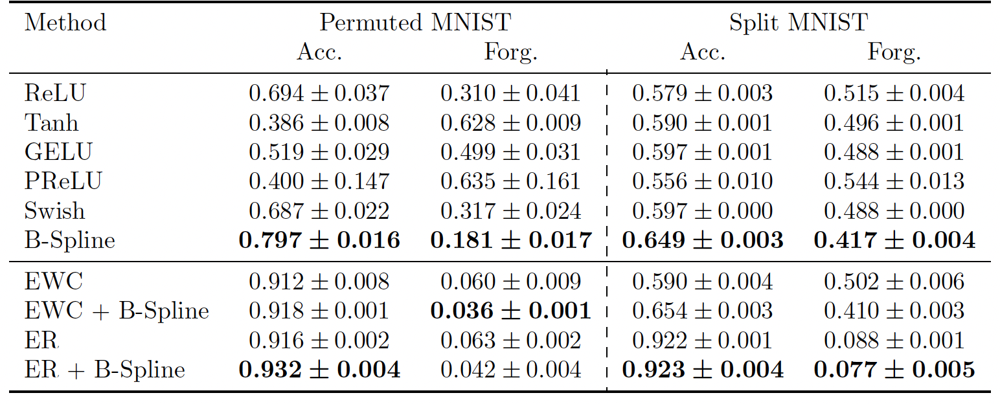
</p>


**Key findings:**
-The improvement in forgetting without any explicit continual learning method (specially in domain incremental benchmark) is notable B-spline shows **42% and 14% less forgetting** compared to the next-best activation, along with approximately **15% higher accuracy**, in Permuted MNIST and Split MNIST, respectively. The improvement is consistent across multiple seeds with low variance.
-B-spline activations provide **additional gains** when combined with strong continual learning methods and the best overal relusts are obtained by combining them. With EWC: **40% and 18% reduction in forgetting** and with ER: **33% and 12% forgetting reduction**.


<!-- <p align="center">
  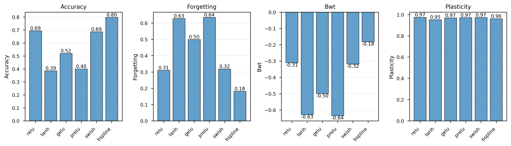
</p>

<p align="center">
  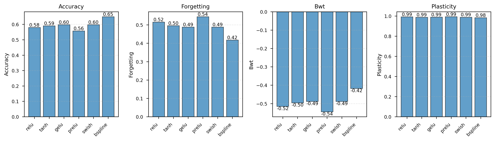
</p> -->


<p align="center">
  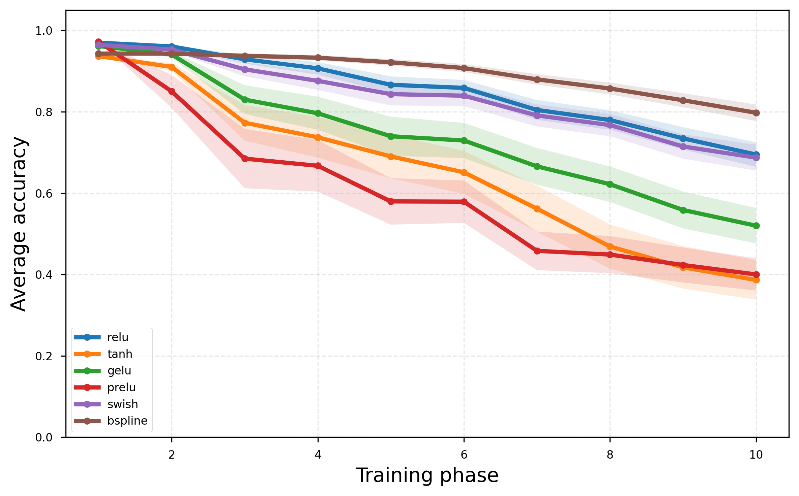
</p>


The evolution of average accuracy over tasks demonstrates while ReLU, Tanh, GELU, and PReLU all show severe degradation after each new task, B-spline maintains a much more gradual decline.


### 3.2 Continual Regression Experiment

We replicated the 1D regression experiment from KAN paper [1] to see whether our approach could learn the peaks sequentially without forgetting the previous ones. In this experiment data around each peak is given to the network sequentially (instead of all at once). The result show that B-splines demonstrate the ability to retain previously learned peaks while adapting to new ones. Unlike ReLU activation which exhibit severe catastrophic forgetting (completely losing earlier peaks).


- During this experiment we observed **high sensitivity** to hyperparameters, the number of control points, degree, and domain bounds. we used random grid search to find a good combination of hyperparameters. This observation could point out a limitation of this approach.


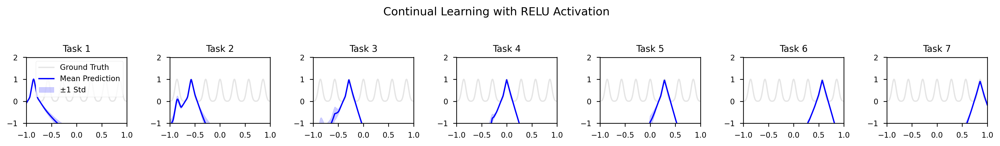
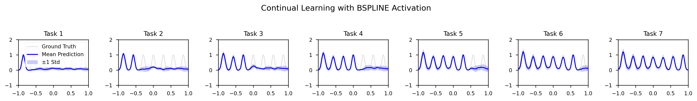


### 3.3 Ablation Studies

We conducted ablation studies with 3 random seeds to systematically evaluate the impact of key parameters on performance. 

#### 3.3.1 Initialization Strategy

Comparing random, identity, ReLU, and leaky ReLU initialization for control points revealed ReLU and leaky ReLU initialization achieve the best performance with high accuracy and low forgetting, while random and identity initializations underperform.


<p align="center">
  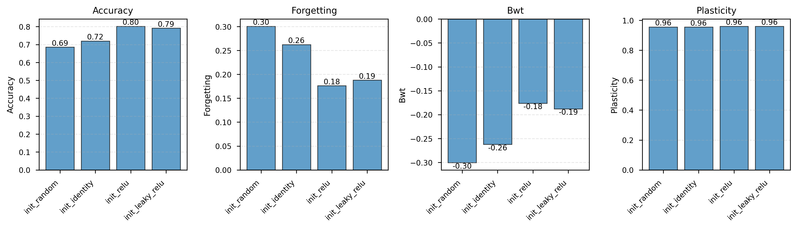
</p>


#### 3.3.2 Shared Activation Across All Layers

We next evaluate the effect of sharing a single B-spline activation across all layers versus using layer-specific activations. Table 2 demonstrate even sharing one single B-Spline activation results in less forgetting than using ReLU.

<p align="center">
  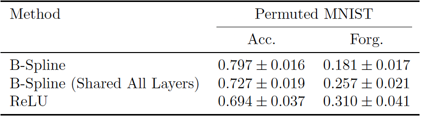
</p>


#### 3.3.3 Number of Control Points

Analysis of 3, 5, 7, 10, 15, 20, 30 and 50 control points revealed that accuracy improves and forgetting decreases as the number of control points increases, up to a sweet spot beyond which additional control points provide diminishing returns. Very small numbers of control points limit expressiveness, while excessively large numbers do not get performance gains.


<p align="center">
  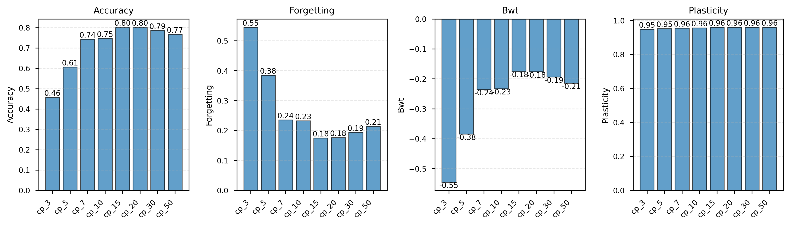
</p>


The corresponding accuracy heatmaps visually confirm this trend.

<p align="center">
  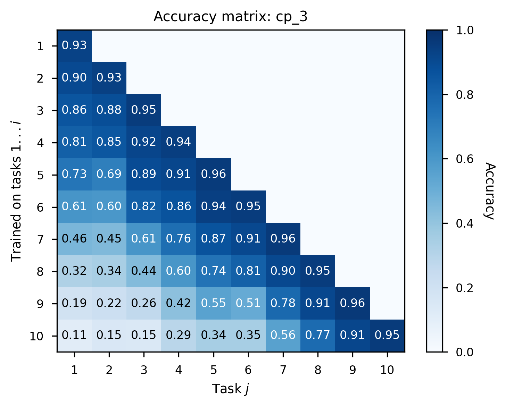
  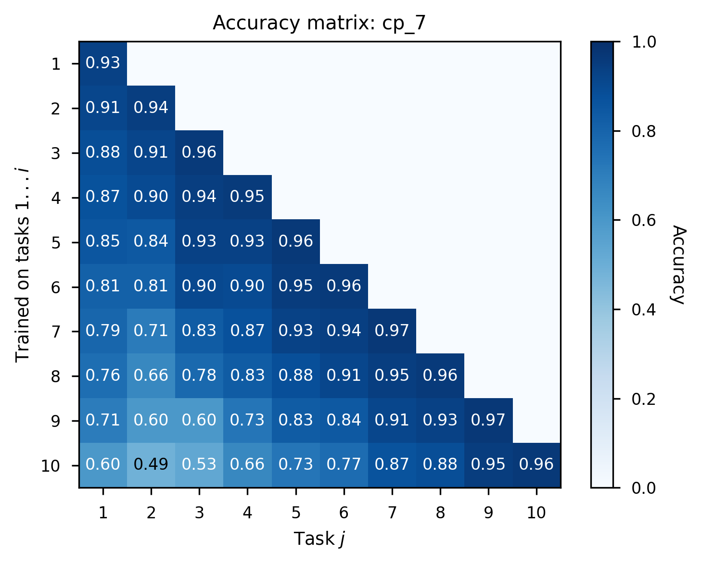
  
  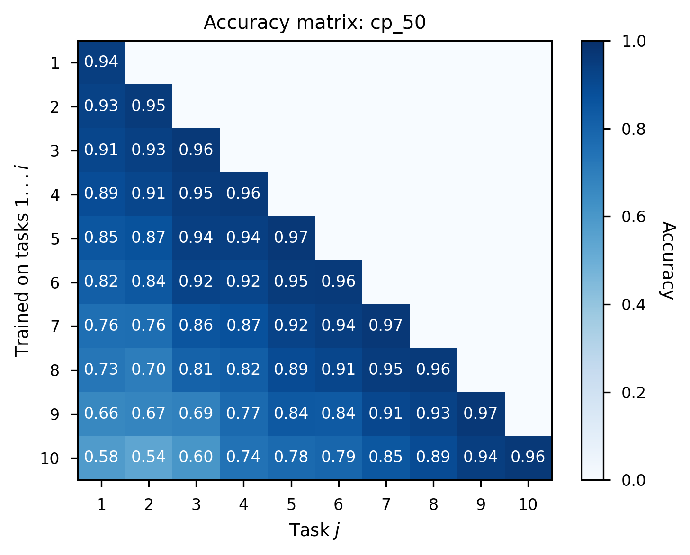
</p>


**Note**
All ablation results are reported on the domain incremental benchmark. In the more challenging class incremental Split MNIST setting, variations in hyperparameters did not lead to noticeable performance improvements.

---

## 4. Conclusion
In conclusion, our approach of using shared B-spline activation functions in MLPs could help mitigate catastrophic forgetting. Our experiments demonstrate using shared B-spline activations reduces forgetting even without explicit continual learning methods. They also provide complementary benefits when combined with techniques like EWC and Experience Replay. In ablations we found that ReLU initialization and moderate numbers of control points (15-30) yield optimal performance, and sharing a single B-Spline across all layers still outperforms ReLU in terms of accuracy and forgetting.
Studies on learnable activation functions have shown they allow for "a reduction of the overall size of the network for a given accuracy" due to their flexibility [5]. Our shared B-spline approach balances this flexibility with parameter efficiency: each layer has only `num_control_points` additional parameters (e.g., 20 parameters for default configuration).

---

## 5. Limitations and Future Work

**Spline Input Overlap**: We discussed that B-splines have a locality property, meaning that changing the function in one input region only affects a limited part of the activation. Now what if two tasks require changes in the same region of the input space? In this case, both tasks rely on the same spline coefficients, and learning the new task inevitably updates coefficients that were important for the previous task. This problem becomes more severe in our approach, because the B-spline activation function is shared globally across the entire layer. Gating mechanisms or control point regularization could potentially mitigate this issue, and we leave their investigation for future work.

**Scaling to Deeper Networks**: Our experiments focus on relatively shallow networks. Investigation in modern deep architectures is needed.


**Hyperparameter Sensitivity**: Our studies revealed sensitivity to the hyperparameters in some cases. Adaptive methods for setting these hyperparameters based on task characteristics would be valuable.

**Computational Cost**: While more efficient than KANs, B-spline activations still have additional computation compared to fixed activations.

---

## 6. Project Structure

```
.
├── activations.py      # B-spline activation implementation
├── datasets.py         # Dataset loaders
├── models.py           # MLP model
├── trainer.py          # Training loop and continual learning
├── metrics.py          # CL metrics
├── regress.py          # Continual regression experiment
├── main.py             # Main experiment runner
├── ewc.py              # An implementaion of Elastic Weight Consolidation (EWC)
└── visualize.py        # Plotting functions
```

---

## 7. Usage

### Compare activations:
```bash
python3 main.py --exp compare --dataset split_mnist --num_seeds 5
```

### Run ablation studies:
```bash
python3 main.py --exp ablations --dataset permuted_mnist --num_seeds 3
```

### Continual regression experiment:
```bash
python3 main.py --exp regression --num_peaks 7 --num_seeds 5
```

### Combining with CL methods
```bash
python3 main.py --exp combine_methods --method ewc --num_seeds 5
```


---

## References

[1] Liu, Z., Wang, Y., Vaidya, S., Ruehle, F., Halverson, J., Soljačić, M., ... & Tegmark, M. (2024). Kan: Kolmogorov-arnold networks. arXiv preprint arXiv:2404.19756.

[2] McCloskey, M., & Cohen, N. J. (1989). Catastrophic interference in connectionist networks: The sequential learning problem. Psychology of Learning and Motivation, 24, 109-165.

[3] de Boor, C. (2001). A Practical Guide to Splines. Springer-Verlag.

[4] Bohra, P., Campos, J., Gupta, H., Aziznejad, S., & Unser, M. (2020). Learning activation functions in deep (spline) neural networks. IEEE Open Journal of Signal Processing, 1, 295-309.

[5] Coelho, A. A. R., & Pessôa, A. V. L. (2009). A local approach to B-spline neural network. Neural Networks, 22(5-6), 610-616.

[6] Shene, C. K. (n.d.). B-spline basis functions: Important properties. Michigan Technological University.

[7] Bozorgasl, Z., & Chen, H. (2024). SineKAN: Kolmogorov-Arnold Networks using sinusoidal activation functions. Frontiers in Artificial Intelligence.


[8] Goodfellow, I. J., Mirza, M., Xiao, D., Courville, A., & Bengio, Y. (2013). An empirical investigation of catastrophic forgetting in gradient-based neural networks. arXiv preprint arXiv:1312.6211.

[9] Díaz-Rodríguez, N., Lomonaco, V., Filliat, D., & Maltoni, D. (2018). Don't forget, there is more than forgetting: New metrics for continual learning. Workshop on Continual Learning, NeurIPS.

[10] Qiu, Q., Zhu, T., Gong, H., Chen, L., & Ning, H. (2024). ReLU-KAN: New Kolmogorov-Arnold Networks that Only Need Matrix Addition, Dot Multiplication, and ReLU. arXiv preprint arXiv:2406.02075. 
arXiv

[11] Patra, S., Panda, S., Parida, B. K., Arya, M., Jacobs, K., Bondar, D. I., & Sen, A. (2024). Physics Informed Kolmogorov-Arnold Neural Networks for Dynamical Analysis via Efficient-KAN and WAV-KAN. arXiv preprint arXiv:2407.18373. 
arXiv

[12] Kirkpatrick, J., Pascanu, R., Rabinowitz, N., Veness, J., Desjardins, G., Rusu, A. A., ... & Hadsell, R. (2017). Overcoming catastrophic forgetting in neural networks. Proceedings of the National Academy of Sciences, 114(13), 3521-3526.

[13] Rolnick, D., Ahuja, A., Schwarz, J., Lillicrap, T. P., & Wayne, G. (2019). Experience replay for continual learning. In Advances in Neural Information Processing Systems (NeurIPS), 32.

---

## Contact

For any questions or suggestions, please reach out to:

- **Email**: [mahdi.razi099@gmail.com]

---

## Acknowledgments

Special thanks to my supervisors **Dr. Ali Mohades** for their invaluable guidance and support throughout this project.

---
